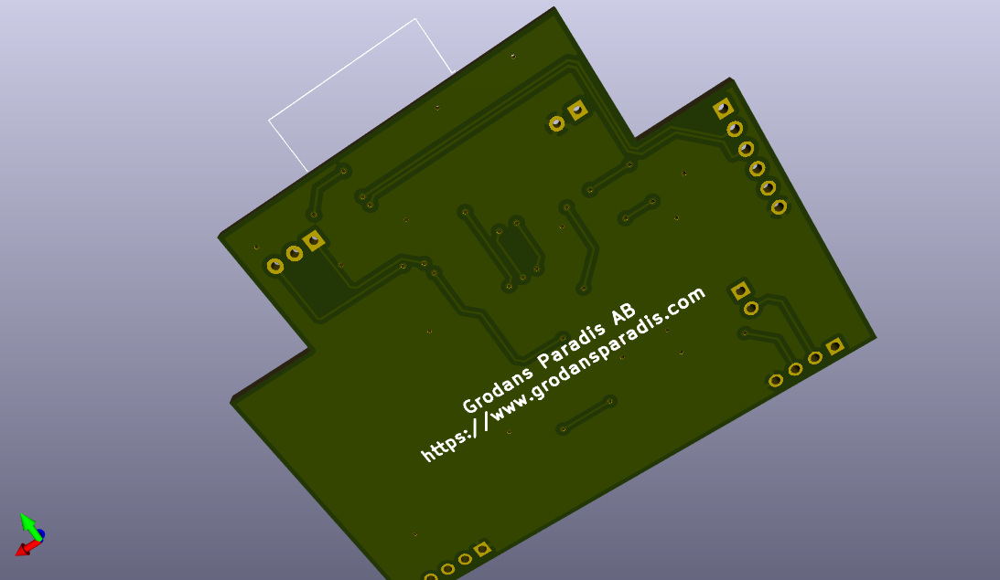
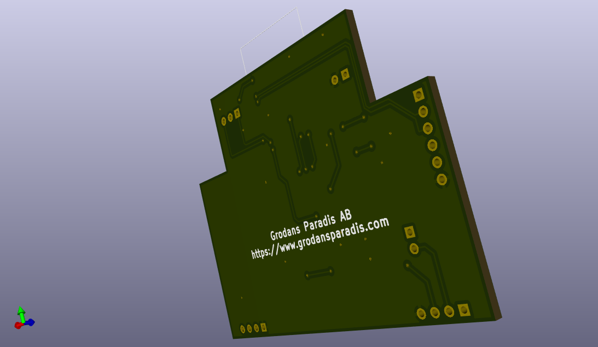

# vscp-din-wireless-esp32-z105
ESP32 based CAN4VSCP FD controller in a single module DIN package with BT and wifi interface.

**Note!** This is still a prototype. ....

## PCB's

 

---

Part of the [VSCP Project](https://www.vscp.org).

Copyright 2021-2022 © Åke Hedman, (Grodans Paradis AB)[https://www.grodansparadis.com]
